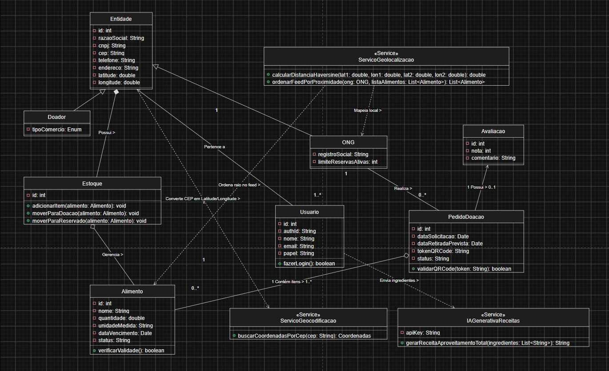
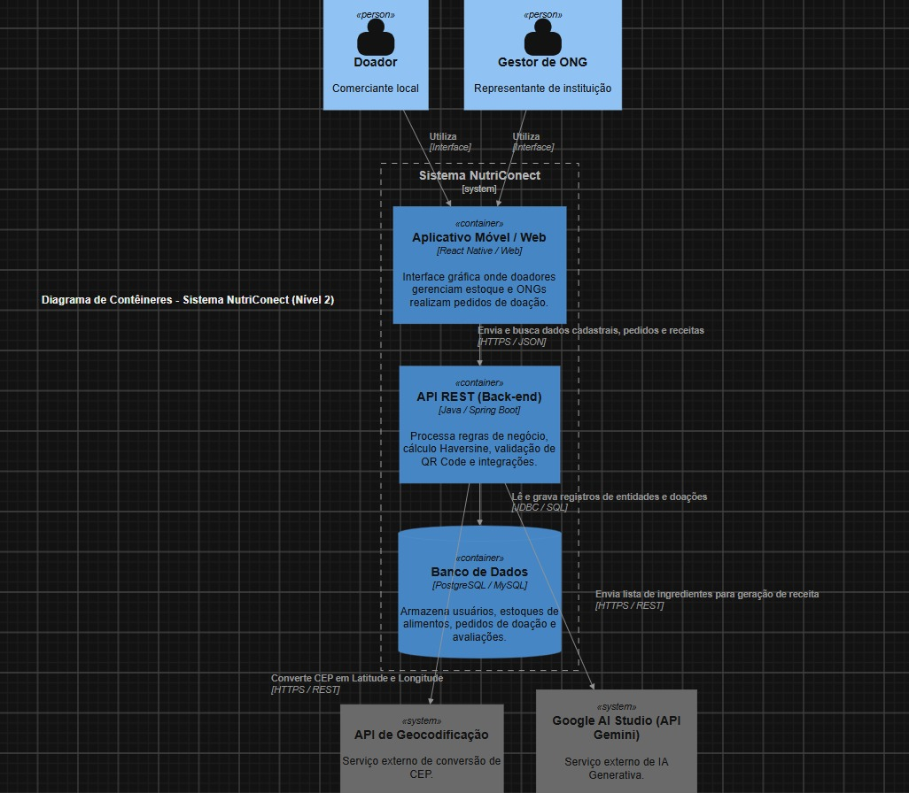

  # NutriConect

Sistema de gestão desenvolvido para apoiar Organizações Não Governamentais (ONGs) no processo de captação, organização e distribuição de alimentos doados por comércios locais. O sistema busca reduzir o desperdício alimentar e fortalecer a capacidade operacional de instituições que atuam diretamente no combate à fome.

## Índice

- [Sobre o Projeto](#sobre-o-projeto)
- [Contextualização: por que o ODS 2](#contextualização-por-que-o-ods-2-fome-zero-e-agricultura-sustentável)
- [O Problema](#o-problema-desperdício-de-alimentos-no-comércio-local-e-vulnerabilidade-das-ongs)
- [Objetivo do Sistema](#objetivo-do-sistema)
- [Público-Alvo](#público-alvo)
- [Inteligência Artificial no Aplicativo](#inteligência-artificial-no-aplicativo)
- [Modelagem do Sistema (UML)](#modelagem-do-sistema-uml)
- [Funcionalidades](#funcionalidades)
- [Tecnologias Utilizadas](#tecnologias-utilizadas)
- [Instalação](#instalação)
- [Como Usar](#como-usar)
- [Contribuição](#contribuição)
- [Licença](#licença)

---

## Sobre o Projeto

Este repositório contém o código-fonte de um sistema de gestão desenvolvido para apoiar Organizações Não Governamentais (ONGs) no processo de captação, organização e distribuição de alimentos doados por comércios locais. O sistema busca reduzir o desperdício alimentar e fortalecer a capacidade operacional de instituições que atuam diretamente no combate à fome.

## Contextualização: por que o ODS 2 (Fome Zero e Agricultura Sustentável)?

A escolha do Objetivo de Desenvolvimento Sustentável (ODS) 2 — Fome Zero e Agricultura Sustentável, definido pela Agenda 2030 da ONU — se justifica pela conexão direta entre o problema identificado e as metas propostas por esse objetivo.

O ODS 2 não trata apenas da produção de alimentos, mas também da garantia de acesso a alimentação adequada e da redução de perdas ao longo de toda a cadeia produtiva e de distribuição. Entre suas metas, destaca-se o compromisso de reduzir pela metade o desperdício de alimentos per capita mundial nos níveis de varejo e consumo, além de diminuir as perdas na cadeia de produção e abastecimento.

No contexto local, observa-se um paradoxo recorrente: enquanto estabelecimentos comerciais descartam diariamente alimentos ainda próprios para consumo, famílias em situação de insegurança alimentar continuam sem acesso regular à comida. Esse projeto se propõe a atuar exatamente nessa lacuna, funcionando como uma ponte tecnológica entre a oferta (comércios com excedentes) e a demanda (ONGs que atendem populações vulneráveis), contribuindo diretamente para as metas do ODS 2.

## O Problema: Desperdício de Alimentos no Comércio Local e Vulnerabilidade das ONGs

### O desperdício nos comércios locais

Supermercados, feiras, padarias, restaurantes e outros estabelecimentos comerciais descartam, diariamente, grandes volumes de alimentos que ainda estão em condições adequadas para consumo. Esse desperdício ocorre por diversos motivos, entre eles:

- **Vencimento de prazos comerciais**, muitas vezes anteriores à data real de validade;
- **Excesso de produção ou compra**, gerando sobras não comercializadas;
- **Padrões estéticos de mercado**, que descartam alimentos com aparência fora do "padrão", mesmo estando próprios para consumo;
- **Ausência de processos estruturados de doação**, que fazem com que o descarte se torne o caminho mais simples e imediato para o comerciante.

Esse cenário resulta em perdas econômicas para os comércios, impacto ambiental significativo (como emissão de gases de efeito estufa por alimentos em decomposição em aterros) e, sobretudo, no desperdício de um recurso que poderia estar suprindo necessidades básicas da população.

### A vulnerabilidade das ONGs

Do outro lado dessa cadeia, muitas ONGs que atuam na distribuição de alimentos e no combate à fome enfrentam desafios estruturais significativos:

- **Dependência de doações irregulares**, sem previsibilidade de volume, tipo ou frequência;
- **Falta de recursos tecnológicos** para gerenciar cadastros de beneficiários, estoque de doações e logística de distribuição;
- **Processos manuais e descentralizados**, que dificultam o registro de informações, a comunicação com doadores e a tomada de decisão;
- **Limitação de equipe e infraestrutura**, o que reduz a capacidade de resposta rápida a excedentes disponíveis nos comércios.

Essa combinação de fatores — desperdício de um lado e escassez de recursos de gestão do outro — evidencia a necessidade de uma solução que organize, sistematize e facilite essa conexão, otimizando o aproveitamento de alimentos e fortalecendo a atuação das ONGs junto às comunidades que atendem.

## Objetivo do Sistema

Diante desse cenário, o sistema desenvolvido neste projeto tem como objetivo oferecer às ONGs uma ferramenta de gestão que permita:

- Registrar e organizar doações recebidas de comércios locais;
- Gerenciar estoque de alimentos de forma simples e acessível;
- Acompanhar a distribuição para beneficiários;
- Facilitar a comunicação e o histórico de parcerias com doadores.

Com isso, busca-se reduzir o desperdício de alimentos, fortalecer a capacidade operacional das ONGs e contribuir de forma concreta para as metas do ODS 2 no contexto local.

## Público-Alvo

Dentro do projeto NutriConect, existem dois principais públicos-alvo: os **Doadores** e os **Receptores**. Embora possuam necessidades e objetivos diferentes, ambos estão diretamente relacionados à proposta do aplicativo, que busca criar uma ponte entre alimentos que poderiam ser desperdiçados e pessoas ou instituições que necessitam desses recursos.

### Doadores

O primeiro público-alvo é formado pelos doadores, que podem ser comerciantes, feirantes, supermercados locais, pequenos estabelecimentos e também moradores que possuam alimentos próprios para consumo que não serão mais utilizados. Esses usuários terão um papel fundamental no funcionamento do NutriConect, pois serão responsáveis por disponibilizar os alimentos que poderão ser destinados a instituições e comunidades em situação de vulnerabilidade social.

Entre as principais características desse público está a necessidade de encontrar uma forma simples, rápida e segura de realizar doações, evitando que alimentos ainda próprios para consumo sejam descartados. No caso de comerciantes e estabelecimentos, por exemplo, podem existir produtos próximos da data de validade, alimentos que não atendem mais aos padrões comerciais de aparência ou itens que não foram vendidos dentro do período esperado, mas que ainda apresentam condições adequadas para consumo.

O aplicativo pretende facilitar esse processo, permitindo que o doador informe quais alimentos estão disponíveis, a quantidade, as condições para retirada e outras informações necessárias. Dessa forma, além de contribuir para a redução do desperdício, o doador poderá participar de uma ação social de maneira prática e organizada.

### Receptores

**Entidade (Classe Base):** Centraliza os dados cadastrais gerais e geolocalização (`id: int`, `razaoSocial: String`, `cnpj: String`, `cep: String`, `telefone: String`, `endereco: String`, `latitude: double`, `longitude: double`).

**Usuario:** Gerencia autenticação e papéis de acesso no sistema (`id: int`, `authId: String`, `nome: String`, `email: String`, `papel: String`) com o método `fazerLogin(): boolean`.

**Doador (Especialização de Entidade):** Representa o doador da plataforma, contendo o atributo de negócio `tipoComercio: Enum`.

**ONG (Especialização de Entidade):** Representa a instituição receptora com `registroSocial: String` e `limiteReservasAtivas: int`.

**Serviços de Localização:** O **ServicoGeocodificacao** faz a conversão via `buscarCoordenadasPorCep(cep: String): Coordenadas`, enquanto o **ServicoGeolocalizacao** realiza o cálculo via `calcularDistanciaHaversine(...)` e a ordenação de feed por proximidade via `ordenarFeedPorProximidade(...)`.

## Inteligência Artificial (`IAGenerativaReceitas`)

Um dos grandes diferenciais do projeto é a integração com **Inteligência Artificial Generativa**, focada no **Aproveitamento Total dos Alimentos** e no combate ao desperdício.

###  Como Funciona
Enquanto o sistema gerencia as doações e a logística de estoque, o serviço de IA auxilia as ONGs e doadores a reaproveitarem ao máximo os insumos disponíveis (incluindo sobras próprias para consumo, talos e cascas).

**Entrada de Dados:** O usuário ou ONG seleciona ou digita a lista de ingredientes disponíveis em mãos (ex: *arroz de ontem, casca de abóbora, frango*).

**Processamento:** A aplicação envia essa lista para a classe de serviço `IAGenerativaReceitas`.

**Resposta Criativa:** A IA processa os itens e retorna uma receita culinária passo a passo, criativa e nutritiva, evitando o descarte desnecessário de alimentos.
  
## Arquitetura do Sistema (Modelo C4)

Para garantir que todas as frentes de desenvolvimento (Front-end e Back-end) estejam alinhadas e que a integração com os serviços de Inteligência Artificial seja viável e segura, a arquitetura do NutriConect foi documentada utilizando o **Modelo C4**. 

### Diagrama de Contexto (Nível 1)
O diagrama de contexto ilustra a visão macro do NutriConect, mostrando nossos principais usuários (Doadores e Gestores de ONG) e como o nosso sistema interage com plataformas externas para entregar valor.

> **Nota:** O Nível 1 demonstra a relação de atores externos com o ecossistema NutriConect.
> 
>  

### Diagrama de Contêineres (Nível 2)

> **Nota:** O Nível 2 deste diagrama faz um "zoom" no nosso sistema, detalhando os grandes blocos de execução, suas tecnologias e como os dados fluem entre eles.
>
>  

### Justificativas Técnicas

As escolhas arquiteturais foram feitas pensando no crescimento sustentável da plataforma e na segurança dos dados:

**Back-end em Java com Spring Boot:** A escolha deste ecossistema garante alta escalabilidade para lidar com um volume crescente de doações e acessos simultâneos. Além disso, oferece um módulo nativo rigoroso de segurança (Spring Security), essencial para proteger dados sensíveis de usuários e organizações.

**Consumo Isolado da Google Gemini API (Inteligência Artificial):** A comunicação com o Google AI Studio para a nossa geração de receitas focada no ODS 2 é feita **exclusivamente pelo nosso servidor Back-end (Java)**. Esse isolamento protege nossas chaves de API contra interceptação no lado do cliente e centraliza as regras de negócio. O aplicativo apenas interage com a nossa API, que por sua vez consome a IA e devolve o resultado seguro.

**Banco de Dados Relacional (PostgreSQL/MySQL):** Garante a integridade referencial complexa necessária para vincular de forma consistente os Doadores, ONGs, Estoques e Históricos de Transações.

**Integração com API de Geocodificação:** Vital para o nosso algoritmo de Matching Geográfico por Raio. O back-end converte os CEPs cadastrados em coordenadas (Latitude e Longitude), permitindo que o sistema calcule a distância e sugira as ONGs mais próximas de forma eficiente.
