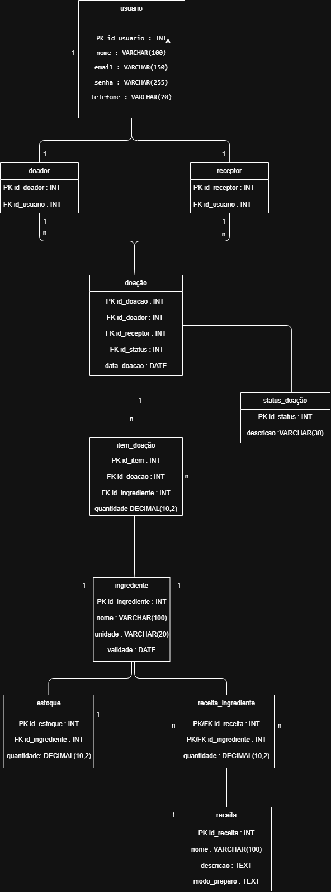
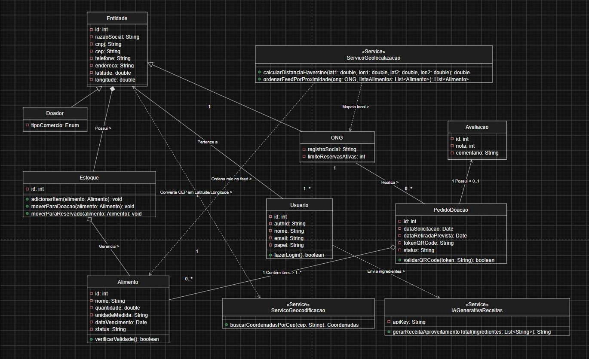
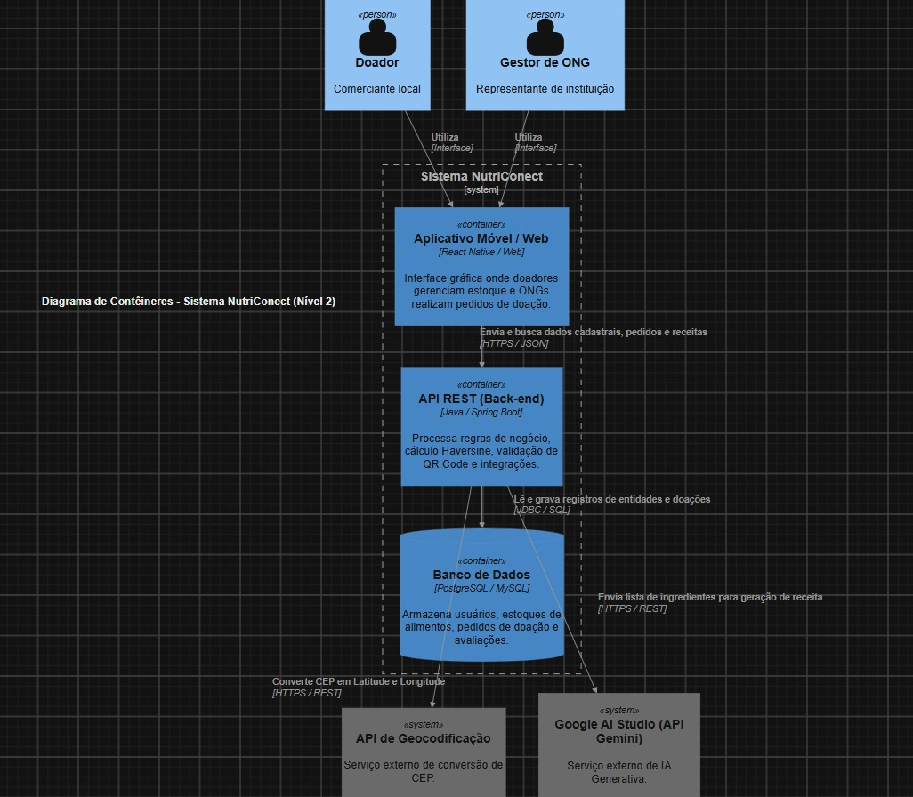

# NutriConect

Sistema de gestão desenvolvido para apoiar Organizações Não Governamentais (ONGs) no processo de captação, organização e distribuição de alimentos doados por comércios locais. O sistema busca reduzir o desperdício alimentar e fortalecer a capacidade operacional de instituições que atuam diretamente no combate à fome.

## Índice

* [Sobre o Projeto](#sobre-o-projeto)
* [Contextualização: por que o ODS 2](#contextualização-por-que-o-ods-2-fome-zero-e-agricultura-sustentável)
* [O Problema](#o-problema-desperdício-de-alimentos-no-comércio-local-e-vulnerabilidade-das-ongs)
* [Objetivo do Sistema](#objetivo-do-sistema)
* [Público Alvo](#público-alvo)
* [Inteligência Artificial no Aplicativo](#inteligência-artificial-iagenerativareceitas)
* [Modelagem do Sistema (UML)](#modelagem-do-sistema-uml)
* [Arquitetura do Sistema (Modelo C4)](#arquitetura-do-sistema-modelo-c4)
* [Funcionalidades](#funcionalidades)
* [Tecnologias Utilizadas](#tecnologias-utilizadas)
* [Instalação](#instalação)
* [Como Usar](#como-usar)
* [Contribuição](#contribuição)
## Sobre o Projeto

Este repositório contém o código fonte de um sistema de gestão desenvolvido para apoiar Organizações Não Governamentais (ONGs) no processo de captação, organização e distribuição de alimentos doados por comércios locais. O sistema busca reduzir o desperdício alimentar e fortalecer a capacidade operacional de instituições que atuam diretamente no combate à fome.

## Contextualização: por que o ODS 2 (Fome Zero e Agricultura Sustentável)?

A escolha do Objetivo de Desenvolvimento Sustentável (ODS) 2, Fome Zero e Agricultura Sustentável, definido pela Agenda 2030 da ONU, se justifica pela conexão direta entre o problema identificado e as metas propostas por esse objetivo.

O ODS 2 não trata apenas da produção de alimentos, mas também da garantia de acesso a alimentação adequada e da redução de perdas ao longo de toda a cadeia produtiva e de distribuição. Entre suas metas, destaca se o compromisso de reduzir pela metade o desperdício de alimentos per capita mundial nos níveis de varejo e consumo, além de diminuir as perdas na cadeia de produção e abastecimento.

No contexto local, observa se um paradoxo recorrente: enquanto estabelecimentos comerciais descartam diariamente alimentos ainda próprios para consumo, famílias em situação de insegurança alimentar continuam sem acesso regular à comida. Esse projeto se propõe a atuar exatamente nessa lacuna, funcionando como uma ponte tecnológica entre a oferta (comércios com excedentes) e a demanda (ONGs que atendem populações vulneráveis), contribuindo diretamente para as metas do ODS 2.

## O Problema: Desperdício de Alimentos no Comércio Local e Vulnerabilidade das ONGs

### O desperdício nos comércios locais

Supermercados, feiras, padarias, restaurantes e outros estabelecimentos comerciais descartam, diariamente, grandes volumes de alimentos que ainda estão em condições adequadas para consumo. Esse desperdício ocorre por diversos motivos, entre eles:

* Vencimento de prazos comerciais, muitas vezes anteriores à data real de validade;
* Excesso de produção ou compra, gerando sobras não comercializadas;
* Padrões estéticos de mercado, que descartam alimentos com aparência fora do padrão, mesmo estando próprios para consumo;
* Ausência de processos estruturados de doação, que fazem com que o descarte se torne o caminho mais simples e imediato para o comerciante.

Esse cenário resulta em perdas econômicas para os comércios, impacto ambiental significativo (como emissão de gases de efeito estufa por alimentos em decomposição em aterros) e, sobretudo, no desperdício de um recurso que poderia estar suprindo necessidades básicas da população.

### A vulnerabilidade das ONGs

Do outro lado dessa cadeia, muitas ONGs que atuam na distribuição de alimentos e no combate à fome enfrentam desafios estruturais significativos:

* Dependência de doações irregulares, sem previsibilidade de volume, tipo ou frequência;
* Falta de recursos tecnológicos para gerenciar cadastros de beneficiários, estoque de doações e logística de distribuição;
* Processos manuais e descentralizados, que dificultam o registro de informações, a comunicação com doadores e a tomada de decisão;
* Limitação de equipe e infraestrutura, o que reduz a capacidade de resposta rápida a excedentes disponíveis nos comércios.

Essa combinação de fatores evidencia a necessidade de uma solução que organize, sistematize e facilite essa conexão, otimizando o aproveitamento de alimentos e fortalecendo a atuação das ONGs junto às comunidades que atendem.

## Objetivo do Sistema

Diante desse cenário, o sistema desenvolvido neste projeto tem como objetivo oferecer às ONGs uma ferramenta de gestão que permita:

* Registrar e organizar doações recebidas de comércios locais;
* Gerenciar estoque de alimentos de forma simples e acessível;
* Acompanhar a distribuição para beneficiários;
* Facilitar a comunicação e o histórico de parcerias com doadores.

Com isso, busca se reduzir o desperdício de alimentos, fortalecer a capacidade operacional das ONGs e contribuir de forma concreta para as metas do ODS 2 no contexto local.

## Público Alvo

Dentro do projeto NutriConect, existem dois principais públicos alvo: os Doadores e os Receptores. Embora possuam necessidades e objetivos diferentes, ambos estão diretamente relacionados à proposta do aplicativo, que busca criar uma ponte entre alimentos que poderiam ser desperdiçados e pessoas ou instituições que necessitam desses recursos.

### Doadores

O primeiro público alvo é formado pelos doadores, que podem ser comerciantes, feirantes, supermercados locais, pequenos estabelecimentos e também moradores que possuam alimentos próprios para consumo que não serão mais utilizados. Esses usuários terão um papel fundamental no funcionamento do NutriConect, pois serão responsáveis por disponibilizar os alimentos que poderão ser destinados a instituições e comunidades em situação de vulnerabilidade social.

Entre as principais características desse público está a necessidade de encontrar uma forma simples, rápida e segura de realizar doações, evitando que alimentos ainda próprios para consumo sejam descartados. No caso de comerciantes e estabelecimentos, por exemplo, podem existir produtos próximos da data de validade, alimentos que não atendem mais aos padrões comerciais de aparência ou itens que não foram vendidos dentro do período esperado, mas que ainda apresentam condições adequadas para consumo.

O aplicativo pretende facilitar esse processo, permitindo que o doador informe quais alimentos estão disponíveis, a quantidade, as condições para retirada e outras informações necessárias. Dessa forma, além de contribuir para a redução do desperdício, o doador poderá participar de uma ação social de maneira prática e organizada.

### Receptores

O segundo público alvo é formado pelos receptores, que incluem gestores de Organizações Não Governamentais (ONGs), abrigos, cozinhas comunitárias, projetos sociais e outras instituições que atendam pessoas em situação de vulnerabilidade social.

Esse público enfrenta, em muitos casos, dificuldades relacionadas à falta de recursos financeiros para a aquisição regular de alimentos, além dos desafios para encontrar doações e organizar sua logística de recebimento. Por esse motivo, o NutriConect busca oferecer uma maneira mais direta de localizar alimentos disponíveis para doação e estabelecer contato com possíveis doadores.

## Modelagem do Sistema (UML)

* **Entidade (Classe Base):** Centraliza os dados cadastrais gerais e geolocalização (id: int, razaoSocial: String, cnpj: String, cep: String, telefone: String, endereco: String, latitude: double, longitude: double).
* **Usuario:** Gerencia autenticação e papéis de acesso no sistema (id: int, authId: String, nome: String, email: String, papel: String) com o método fazerLogin(): boolean.
* **Doador (Especialização de Entidade):** Representa o doador da plataforma, contendo o atributo de negócio tipoComercio: Enum.
* **ONG (Especialização de Entidade):** Representa a instituição receptora com registroSocial: String e limiteReservasAtivas: int.
* **Serviços de Localização:** O ServicoGeocodificacao faz a conversão via buscarCoordenadasPorCep(cep: String): Coordenadas, enquanto o ServicoGeolocalizacao realiza o cálculo via calcularDistanciaHaversine(...) e a ordenação de feed por proximidade via ordenarFeedPorProximidade(...).

### Diagrama do Banco de Dados (modelo conceitual)

Proposta de modelagem relacional elaborada pelo grupo:



> **Observação:** este diagrama é o modelo conceitual. A implementação atual (entidades JPA) é uma versão mais enxuta: cada `Doacao` referencia um único ingrediente diretamente (sem `item_doacao`), o status da doação é um enum (`StatusDoacao`) em vez de tabela, e `Estoque` guarda doador, ingrediente, quantidade e validade. Evoluir o código para o modelo completo está na lista de próximos passos.

### Material de referência

* [`docs/nutriconect-esqueleto-diana.zip`](docs/nutriconect-esqueleto-diana.zip): esqueleto Spring Boot elaborado pela Diana (pacote `br.com.nutriconect`), com um `GlobalExceptionHandler` e exemplos de controllers. Serve como consulta e **não faz parte da aplicação**; o tratamento de erros em uso está em `com.nutriconect.exception`.
* [`docs/REVISAO-REPOSITORIO.md`](docs/REVISAO-REPOSITORIO.md): histórico da revisão do repositório, com o status de cada problema encontrado.

## Inteligência Artificial (IAGenerativaReceitas)

Um dos grandes diferenciais do projeto é a integração com Inteligência Artificial Generativa, focada no Aproveitamento Total dos Alimentos e no combate ao desperdício.

### Como Funciona

Enquanto o sistema gerencia as doações e a logística de estoque, o serviço de IA auxilia as ONGs e doadores a reaproveitarem ao máximo os insumos disponíveis (incluindo sobras próprias para consumo, talos e cascas).

* **Entrada de Dados:** O usuário ou ONG seleciona ou digita a lista de ingredientes disponíveis em mãos (ex: arroz de ontem, casca de abóbora, frango).
* **Processamento:** A aplicação envia essa lista para a classe de serviço IAGenerativaReceitas.
* **Resposta Criativa:** A IA processa os itens e retorna uma receita culinária passo a passo, criativa e nutritiva, evitando o descarte desnecessário de alimentos.

## Arquitetura do Sistema (Modelo C4)

Para garantir que todas as frentes de desenvolvimento (Frontend e Backend) estejam alinhadas e que a integração com os serviços de Inteligência Artificial seja viável e segura, a arquitetura do NutriConect foi documentada utilizando o Modelo C4.

### Diagrama de Contexto (Nível 1)

O diagrama de contexto ilustra a visão macro do NutriConect, mostrando nossos principais usuários (Doadores e Gestores de ONG) e como o nosso sistema interage com plataformas externas para entregar valor.

> **Nota:** O Nível 1 demonstra a relação de atores externos com o ecossistema NutriConect.



### Diagrama de Contêineres (Nível 2)

> **Nota:** O Nível 2 deste diagrama faz um zoom no nosso sistema, detalhando os grandes blocos de execução, suas tecnologias e como os dados fluem entre eles.



### Justificativas Técnicas

As escolhas arquiteturais foram feitas pensando no crescimento sustentável da plataforma e na segurança dos dados:

* **Backend em Java com Spring Boot:** A escolha deste ecossistema garante alta escalabilidade para lidar com um volume crescente de doações e acessos simultâneos. Além disso, oferece um módulo nativo rigoroso de segurança (Spring Security), essencial para proteger dados sensíveis de usuários e organizações.
* **Consumo Isolado da Google Gemini API (Inteligência Artificial):** A comunicação com o Google AI Studio para a nossa geração de receitas focada no ODS 2 é feita exclusivamente pelo nosso servidor Backend (Java). Esse isolamento protege nossas chaves de API contra interceptação no lado do cliente e centraliza as regras de negócio. O aplicativo apenas interage com a nossa API, que por sua vez consome a IA e devolve o resultado seguro.
* **Banco de Dados Relacional (PostgreSQL/MySQL):** Garante a integridade referencial complexa necessária para vincular de forma consistente os Doadores, ONGs, Estoques e Históricos de Transações.
* **Integração com API de Geocodificação:** Vital para o nosso algoritmo de Matching Geográfico por Raio. O backend converte os CEPs cadastrados em coordenadas (Latitude e Longitude), permitindo que o sistema calcule a distância e sugira as ONGs mais próximas de forma eficiente.

## Funcionalidades

### Disponíveis nesta versão
* **Cadastro de doadores**, com senha criptografada (BCrypt) e verificação de e-mail duplicado.
* **Cadastro e listagem de ingredientes** (nome, categoria, unidade e validade).
* **Registro de doações com vários itens**: cada doação tem um doador, um ou mais itens (ingrediente + quantidade) e, opcionalmente, um receptor; nasce com o status `PENDENTE` (os status ficam em uma tabela própria).
* **Geração de receitas com IA (Google Gemini)**: a partir de uma lista de ingredientes, devolve uma receita de aproveitamento total, alinhada ao ODS 2. Inclui tempo limite e novas tentativas automáticas quando o serviço está sobrecarregado.
* **Validação de dados e respostas de erro padronizadas** (`400`, `404` e `503`).
* **Modelo de dados relacional alinhado ao diagrama do grupo**: usuário, doador, receptor, doação, item da doação, status da doação, ingrediente, estoque, receita e receita–ingrediente (10 tabelas).

### Planejadas
* Autenticação e autorização (login).
* Cadastro de receptores (ONGs) e gestão de estoque com data de validade.
* Listagem, acompanhamento e atualização do status das doações.
* Matching geográfico por raio, sugerindo as ONGs mais próximas do doador.
* Salvar no banco as receitas geradas pela IA.
* Interface (frontend) para doadores e ONGs.

## Tecnologias Utilizadas

| Área | Tecnologia |
|---|---|
| Linguagem | Java 17 |
| Framework | Spring Boot 3.2.5 (Spring Web, Spring Data JPA, Bean Validation) |
| Banco de dados | PostgreSQL (produção/desenvolvimento) e H2 em memória (testes) |
| Persistência | JPA / Hibernate |
| Segurança | Spring Security Crypto (BCrypt) para senhas |
| Inteligência Artificial | Google Gemini API, consumida apenas pelo backend |
| Build | Maven |
| Testes | JUnit 5, Mockito e Spring Test (`MockRestServiceServer`) |
| Arquitetura e modelagem | Modelo C4 e diagramas UML (veja as seções acima) |

## Instalação

### Pré-requisitos
* **JDK 17 ou superior**
* **PostgreSQL 15 ou superior** (testado com a 17)
* **Maven 3.9+**, ou o IntelliJ IDEA, que já traz o Maven embutido
* Uma **chave da API do Google Gemini** (criada no [Google AI Studio](https://aistudio.google.com/apikey)), necessária só para gerar receitas

### 1. Clonar o repositório
```bash
git clone https://github.com/mariliamezalheiradev/NutriConect.git
cd NutriConect
```

### 2. Criar o banco de dados
No pgAdmin ou no `psql`:
```sql
CREATE DATABASE nutriconect;
```
As tabelas são criadas automaticamente na primeira execução.

> **Já rodou uma versão anterior do projeto?** O modelo de dados mudou (por exemplo, `tb_doacao` agora tem itens e status em tabelas próprias). Como não há ferramenta de migração, recrie o banco antes de subir esta versão: no pgAdmin, apague o banco `nutriconect` e crie-o de novo, ou execute `DROP SCHEMA public CASCADE; CREATE SCHEMA public;` conectado a ele.

### 3. Configurar as variáveis de ambiente
Nenhum segredo fica no código: a aplicação lê tudo de variáveis de ambiente.

| Variável | Obrigatória | Padrão | Descrição |
|---|---|---|---|
| `DB_URL` | não | `jdbc:postgresql://localhost:5432/nutriconect` | URL do banco |
| `DB_USER` | não | `postgres` | Usuário do banco |
| `DB_PASSWORD` | sim, se o usuário tiver senha | vazio | Senha do banco |
| `GEMINI_API_KEY` | só para gerar receitas | vazio | Chave da API do Gemini |
| `GEMINI_MODEL` | não | `gemini-flash-latest` | Modelo do Gemini, caso o padrão seja descontinuado |

> **Nunca** escreva a chave ou a senha em arquivos do projeto nem as envie ao Git.

### 4. Executar

**Pelo IntelliJ IDEA**
1. Abra a pasta do projeto (**File → Open**) e aguarde o Maven carregar as dependências.
2. Abra `NutriConectApplication.java` e clique no triângulo verde ao lado do `main`.
3. Em **Edit Configurations → Modify options → Environment variables**, informe, por exemplo:
   `DB_PASSWORD=sua_senha;GEMINI_API_KEY=sua_chave`

**Pelo terminal**

Linux/macOS:
```bash
export DB_PASSWORD=sua_senha
export GEMINI_API_KEY=sua_chave
mvn spring-boot:run
```
Windows (PowerShell):
```powershell
$env:DB_PASSWORD = "sua_senha"
$env:GEMINI_API_KEY = "sua_chave"
mvn spring-boot:run
```

A aplicação sobe em `http://localhost:8080`. O console termina com `Started NutriConectApplication`.

### 5. Executar os testes
```bash
mvn clean test
```
Os testes usam um banco H2 em memória e não precisam de PostgreSQL nem de chave do Gemini.

## Como Usar

A API recebe e devolve JSON. Os exemplos abaixo usam `curl`; no IntelliJ você pode colar o mesmo conteúdo em um arquivo `.http`, e no Postman basta criar as requisições com o mesmo método, endereço e corpo.

| Método | Endereço | Função |
|---|---|---|
| `POST` | `/api/doadores` | Cadastra um doador |
| `POST` | `/api/ingredientes` | Cadastra um ingrediente |
| `GET` | `/api/ingredientes` | Lista os ingredientes |
| `POST` | `/api/doacoes` | Registra uma doação |
| `POST` | `/api/receitas/gerar` | Gera uma receita com IA |

### Fluxo básico
**1. Cadastrar um doador**
```bash
curl -X POST http://localhost:8080/api/doadores \
  -H "Content-Type: application/json" \
  -d '{"nome":"Mercado Bom Preço","email":"contato@bompreco.com","senha":"senha123","telefone":"11999990000","documento":"12345678000199"}'
```
Resposta (`201`): `{"id":1,"nome":"Mercado Bom Preço","email":"contato@bompreco.com"}`. A senha é guardada criptografada (BCrypt) e nunca é devolvida.

**2. Cadastrar um ingrediente**
```bash
curl -X POST http://localhost:8080/api/ingredientes \
  -H "Content-Type: application/json" \
  -d '{"nome":"Arroz","categoria":"Grãos","unidade":"kg","validade":"2026-12-31"}'
```

**3. Registrar uma doação** (use os `id` devolvidos nos passos anteriores)
```bash
curl -X POST http://localhost:8080/api/doacoes \
  -H "Content-Type: application/json" \
  -d '{"doadorId":1,"itens":[{"ingredienteId":1,"quantidade":10.5}]}'
```
Uma doação pode ter vários itens (um por ingrediente, sem repetir o mesmo ingrediente) e nasce com o status `PENDENTE`. O campo `receptorId` é opcional.

**4. Gerar uma receita de aproveitamento total**
```bash
curl -X POST http://localhost:8080/api/receitas/gerar \
  -H "Content-Type: application/json" \
  -d '{"ingredientes":["arroz","frango","casca de abóbora"]}'
```
Resposta (`200`): `{"receita":"..."}`. A resposta da IA pode levar até cerca de 30 segundos.

### Respostas de erro
| Código | Quando acontece |
|---|---|
| `400` | Dados inválidos ou ausentes, e-mail já cadastrado, doação sem itens, quantidade menor ou igual a zero, ingrediente repetido na doação |
| `404` | Doador, ingrediente ou receptor informado não existe |
| `503` | A IA não está configurada, falhou ou está sobrecarregada. Em caso de sobrecarga (`503` ou `429` do Google), o sistema tenta até 3 vezes antes de desistir |

> **Atenção:** a API ainda não tem login, então os endpoints estão abertos. Não a exponha na internet nesta versão.

## Contribuição

Contribuições são bem-vindas! Para manter o projeto organizado:

1. **Crie uma branch** a partir da `main`, com um nome que descreva o trabalho. Exemplos: `feature/cadastro-receptor`, `fix/validacao-doacao`, `docs/atualiza-readme`.
2. **Faça commits pequenos e claros**, com o prefixo do tipo de mudança: `feat:`, `fix:`, `docs:`, `test:`, `refactor:` ou `chore:`.
3. **Rode os testes** antes de enviar: `mvn clean test`. Eles precisam passar.
4. **Não versione arquivos gerados nem segredos**: `target/`, `.idea/`, chaves de API e senhas ficam de fora (o `.gitignore` já cobre os principais). Use variáveis de ambiente.
5. **Abra um Pull Request** para a `main`, descrevendo o que mudou e como foi testado. Sempre que existir uma issue relacionada, cite-a (por exemplo, `Closes #28`).
6. Aguarde a revisão de pelo menos uma pessoa do grupo antes do merge.
